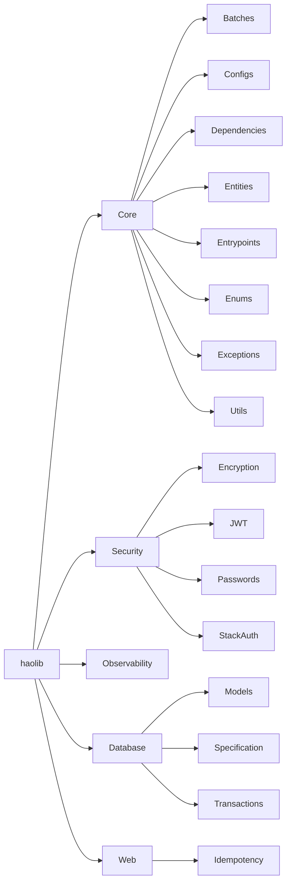
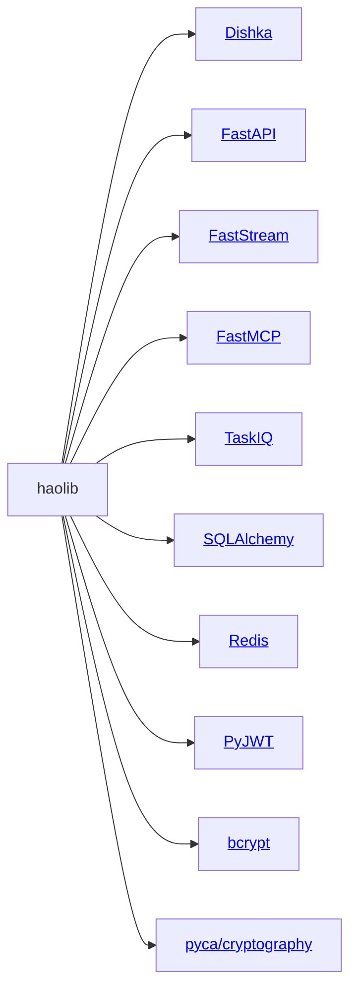

## Still, no installation guide?

Nope! First, let's see what we have in haolib.

```mermaid
    graph LR;
    A[haolib] --> B[Batches]
    B --> B1[Abstract]
    B --> B2[Batch]
    B --> B3[Mapped]
    B --> B4[SQLAlchemy]

    A[haolib] --> C[Configs]
    C --> C1[Base]
    C --> C2[CORS]
    C --> C3[Idempotency]
    C --> C4[JWT]
    C --> C5[Observability]
    C --> C6[Redis]
    C --> C7[Server]
    C --> C8[SQLAlchemy]

    A[haolib] --> D[Database]
    D --> D1[Models]
    D1 --> D11[Base]
    D11 --> D111[SQLAlchemy]
    D1 --> D12[Mapped]
    D12 --> D121[Abstract]
    D12 --> D122[SQLAlchemy]
    D1 --> D13[Mixins]
    D13 --> D131[SQLAlchemy]

    D --> D2[Specification]
    D2 --> D21[Base]
    D2 --> D22[SQLAlchemy]

    D --> D3[Transactions]
    D3 --> D31[Abstract]
    D3 --> D32[SQLAlchemy]

    A[haolib] --> E[Dependencies]
    E --> E1[Dishka]
    E1 --> E11[Redis]
    E1 --> E12[SQLAlchemy]

    A[haolib] --> F[Entities]
    F --> F1[Base]
    F1 --> F11[Create]
    F1 --> F12[Read]
    F1 --> F13[Update]
    F1 --> F14[Delete]

    A[haolib] --> G[Entrypoints]
    G --> G1[Abstract]
    G --> G2[FastAPI]
    G --> G3[FastMCP]
    G --> G4[FastStream]
    G --> G5[TaskIQ]

    A[haolib] --> H[Enums]
    H --> H1[Base]
    H --> H2[Filter]

    A[haolib] --> I[Exceptions]
    I --> I1[Base]
    I1 --> I11[Abstract]
    I1 --> I12[FastAPI]
    I --> I2[Handlers]
    I2 --> I21[FastAPI]
    I --> I3[Schema]
    I3 --> I31[FastAPI]

    A[haolib] --> J[Observability]
    J --> J1[Logfmt]
    J --> J2[Settuper]
    J --> J3[Utils]

    A[haolib] --> K[Security]
    K --> K1[Encryption]
    K1 --> K11[Abstract]
    K1 --> K12[Fernet]
    K --> K2[JWT]
    K2 --> K21[Encoders]
    K21 --> K211[Abstract]
    K21 --> K212[PyJWT]
    K --> K3[StackAuth]
    K3 --> K31[JWK]
    K31 --> K311[Abstract]
    K31 --> K312[PyJWT]
    K --> K5[Utils]
    K5 --> K52[PyJWT]
    K --> K6[FastAPI]
    K --> K4[Passwords]

    A[haolib] --> L[Utils]
    L --> L1[rattrs]
    L --> L2[strings]

    A[haolib] --> M[Web]
    M --> M1[Idempotency]
    M1 --> M11[FastAPI]
    M1 --> M12[Storages]
    M12 --> M121[Abstract]
    M12 --> M122[Redis]

```

import { Dialogue } from '/snippets/dialogue.mdx';

<Dialogue dialogue={
    [
        {
            role: 'writer',
            content: 'Wow! That\'s a lot of stuff! Why can\'t we simply install haolib and begin building already?'
        },
        {
            role: 'reader',
            content: 'The cat is right, I probably do not need to know that much to begin!'
        }
    ]
} />

You are probably right, if you do not have time for exploring the haolib features, you can simply install haolib and begin building!

<Warning>But I'd recommend you to stay on this page for a while if you are a beginner because it'd be better if you learned the basic structure of haolib first. Still, it's only a recommendation, you always can use your favourite LLM to ask questions about the haolib docs.</Warning>

If you decided to stay, let's get back to the project structure. So each [leaf](https://en.wikipedia.org/wiki/Tree_(abstract_data_type)) is just a separate Python module (e.g. haolib -> Batches -> SQLAlchemy stands for the `haolib.batches.sqlalchemy` module).

<Note>
You can follow the links in the map to see the details of each feature.
</Note>

### Now, to be less specific, we're going to show you the map of haolib features, consider those as the use cases of haolib

### Also, it is useful to keep in mind which Python frameworks and libraries haolib integrates with

See? Not that many things to keep in mind! Now, let's finally go through the installation guide!
